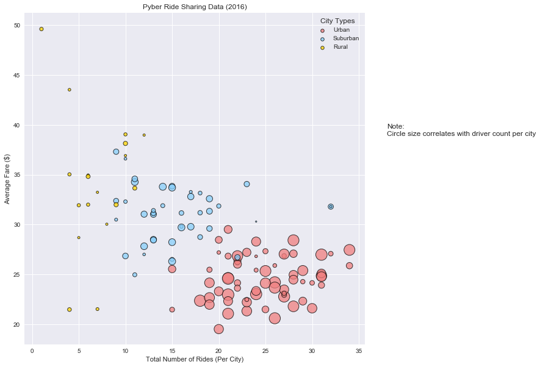
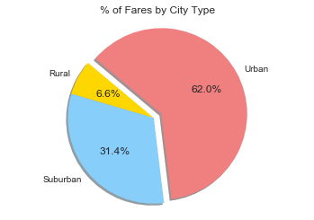
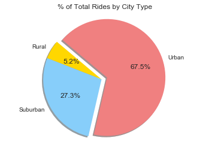
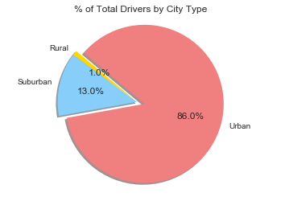

# Pyber Ride Sharing

***

### Analysis

* Although rural drivers are a tiny percentage of the whole (only 1%), they outperform in revenue generation (6.6%) and number of rides (5.2%). This could be because distances between points of interest may be farther in rural areas, requiring more miles and thus pushing up fares. If this is true, then the fact that 1% of drivers contribute 5% of rides is even more remarkable, since we would expect that drives would be longer, allowing for **fewer** rides. Could this be an indicator of strong demand that we can take advantage of?

* Although urban drivers make up almost 86% of drivers, they only contribute a little over 2/3 of rides and around 62% of revenue. This is not surprising; one would expect that in an urban area, there would be a lot more competition for fares, and distances would probably be shorter, leading to fewer rides and lower revenue per driver.

* Suburban drivers tend to outperform urban drivers, as well. As with rural drivers, distances are probably longer, and there is likely less competition in suburban areas than in their urban counterparts. This is an area that should also be explored for potential growth. Unlike rural areas, suburban areas have a larger population from which we can draw drivers. We might also be able to make our urban drivers more productive by directing those who live close to suburbs to the more underserved areas. 

# Bubble Plot of Ride Sharing Data


```python
%matplotlib inline

import matplotlib.pyplot as plt
import matplotlib.patheffects as path_effects
import numpy as np
import pandas as pd
import seaborn as sns


city_input_file = 'raw_data/city_data.csv'
ride_input_file = 'raw_data/ride_data.csv'

city_df = pd.read_csv(city_input_file)
ride_df = pd.read_csv(ride_input_file)

#make copies of data so we can use originals for troubleshooting
city_data_df = city_df.copy()

ride_data_df = ride_df.copy()

#group ride data by city
city_level_ride_data = ride_data_df.groupby(ride_data_df['city'])

#get average fare per city
city_level_avg_fare = city_level_ride_data.mean().reset_index()

# get number of rides per city
city_level_nbr_rides = city_level_ride_data.count().reset_index()

#merge average fare data into city dataframe
city_data_with_avg_fare = pd.merge(city_data_df, city_level_avg_fare, on='city', how='left')

#rename columns for easier reference
city_data_with_avg_fare_renamed = city_data_with_avg_fare.rename(columns={"fare": "average_fare"})

#reorganize data set
city_data_with_avg_fare_work = city_data_with_avg_fare_renamed[['city', 'driver_count', 'type', 'average_fare']]

#merge average fare and ride tables
city_data_with_nbr_rides = pd.merge(city_data_with_avg_fare_work, city_level_nbr_rides, on='city', how='left')

#rename columns for clarity
city_data_with_nbr_rides_renamed = city_data_with_nbr_rides.rename(columns={"ride_id": "nbr_rides"})

#reorganize data set
city_data_work = city_data_with_nbr_rides_renamed[['city', 'driver_count', 'type', 'average_fare', 'nbr_rides']]

#build data set for urban cities
city_data_work_urban = city_data_work.loc[city_data_work['type'] == 'Urban']

#build data set for suburban cities
city_data_work_suburban = city_data_work.loc[city_data_work['type'] == 'Suburban']

#build data set for rural cities
city_data_work_rural = city_data_work.loc[city_data_work['type'] == 'Rural']

#use seaborn default styling
sns.set()
#bubble chart
fig = plt.figure(figsize=(10,10))
ax1 = fig.add_subplot(111)
ax2 = fig.add_subplot(111)
ax3 = fig.add_subplot(111)

#create scatterplots from dataframes
ax1.scatter(city_data_work_urban['nbr_rides'],city_data_work_urban['average_fare'], 
                        (city_data_work_urban['driver_count']*5),facecolors='lightcoral', edgecolors='black', alpha=0.75,
                        label='Urban',linewidth=1.0)
ax2.scatter(city_data_work_suburban['nbr_rides'],city_data_work_suburban['average_fare'], 
                        (city_data_work_suburban['driver_count']*5),facecolors='lightskyblue', edgecolors='black',
                        alpha=0.75,label='Suburban',linewidth=1.0)
ax3.scatter(city_data_work_rural['nbr_rides'],city_data_work_rural['average_fare'], 
                        (city_data_work_rural['driver_count']*5),facecolors='gold', edgecolors='black',
                        alpha=0.75,label='Rural',linewidth=1.0)

#side annotation, labels and legend
textstr = 'Note:\nCircle size correlates with driver count per city'
plt.xlabel('Total Number of Rides (Per City)')
plt.ylabel('Average Fare ($)')
plt.title('Pyber Ride Sharing Data (2016)')
plt.figtext(.95, .60, textstr)
lgnd = plt.legend(loc='best', title = 'City Types')
for handle in lgnd.legendHandles:
    handle.set_sizes([30.0])
    
#display dataset
plt.show()

```

    /Users/mcopple/anaconda3/lib/python3.6/site-packages/matplotlib/cbook/deprecation.py:106: MatplotlibDeprecationWarning: Adding an axes using the same arguments as a previous axes currently reuses the earlier instance.  In a future version, a new instance will always be created and returned.  Meanwhile, this warning can be suppressed, and the future behavior ensured, by passing a unique label to each axes instance.
      warnings.warn(message, mplDeprecation, stacklevel=1)





# Total Fares by City Type


```python
#pyber corporate color scheme for pie charts
colors = ['gold', 'lightskyblue', 'lightcoral']

#keep all the city columns, but we only need the city and fare columns from the ride dataset
ride_data_fare = ride_data_df[['city', 'fare']]

#merge the city and ride_data_fare datasets for the total fares and total drivers by city type charts.
city_fare_driver_data = pd.merge(city_data_df, ride_data_fare, on='city', how='left')

#group data set by city type and sum driver_count and fare columns to get pie chart data
total_fares_drivers_by_city_type = city_fare_driver_data.groupby(city_fare_driver_data['type']).sum().reset_index()

#labels consists of the city types from the type column
labels = total_fares_drivers_by_city_type['type']

#for this pie chart, we are going to use total fares as our pie slice
area_total_fares = total_fares_drivers_by_city_type['fare']

#explode urban out
explode = (0, 0, 0.1)

#build pie chart title
plt.title('% of Fares by City Type')
#build our pie chart
plt.pie(area_total_fares, explode=explode, labels=labels, colors=colors,
        autopct="%1.1f%%", shadow=True, startangle=140)

#let's make it look a little more rounded
plt.axis('equal')

#display the chart
plt.show()

```





# Total Rides by City Type


```python
# first, we need the total number of rides per city type
# we already have that data from the scatterplot, so let's reuse it.
nbr_rides_per_city = city_level_nbr_rides[['city', 'ride_id']].copy()

#now we need city and city type from the city_data dataframe
city_types = city_data_df[['city', 'type']]

# merge the data into a single dataset on city
rides_by_city_type_merged = pd.merge(city_types, nbr_rides_per_city, on='city', how='left')

#Change ride_id to nbr_rides for clarity
total_rides_by_city_type_merged = rides_by_city_type_merged.rename(columns = {"ride_id": "nbr_rides"})

# group the data by city_type and sum up the rides
total_rides_by_city_type = total_rides_by_city_type_merged.groupby(total_rides_by_city_type_merged['type']).sum().reset_index()
total_rides_by_city_type

#time to build the plot. We will use the corporate color scheme but will pull the labels from our new dataset
#notice we are renaming the labels variable here so we don't stomp on the shared variable that Total Fares by City Type
#and Total Drivers by City Type plots are using.
ride_labels = total_rides_by_city_type['type']

#total_rides will be the value plotted -- the number of rides per city type
total_rides = total_rides_by_city_type['nbr_rides']

#We will once again explode urban out
explode = (0, 0, 0.1)

#build pie chart title
plt.title('% of Total Rides by City Type')
#build our pie chart
plt.pie(total_rides, explode=explode, labels=ride_labels, colors=colors,
        autopct="%1.1f%%", shadow=True, startangle=140)

#let's make it look a little more rounded
plt.axis('equal')

#display the chart
plt.show()

```





# Total Drivers by City Type


```python
# For this dataset, we can reuse most of the processing we did for Total Fares by City Type. 
# We will use the total_fares_drivers_by_city_type dataframe to build our plot and labels.
# The only real change is that we will use driver_count for our plotted value:
total_drivers = total_fares_drivers_by_city_type['driver_count']

#We will explode urban out -- we are not reusing this, as results or aesthetics may dictate a different value per
#chart.
explode = (0, 0, 0.1)

#build pie chart title
plt.title('% of Total Drivers by City Type')
#build our pie chart
plt.pie(total_drivers, explode=explode, labels=labels, colors=colors,
        autopct="%1.1f%%", shadow=True, startangle=140)

#let's make it look a little more rounded
plt.axis('equal')

#display the chart
plt.show()
```




